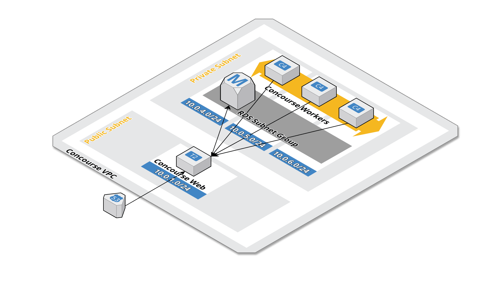

# Concourse AWS Terraform script
Terraform scripts to deploy Concourse into an AWS account.

This Concourse setup runs with a Postgres instance in RDS and workers in a spot request fleet.
This gives a discount to running the workers and also allows a flexible number of instances to be configured in the auto scaling group.



# Deploy to AWS
Setup AWS S3 Backend
```
terraform init -backend-config="bucket=YOUR-BUCKET" -backend-config="key=concourse.tfstate" -backend-config="region=eu-west-1" -backend=true -force-copy -get=true -input=false
```

Create a `terraform.tfvars` from the example `terraform.tfvars.example`

To deploy Concourse to AWS simply run terraform apply. 
```
terraform apply
```

You can optionally define a variable of `private_workers` (default: true).
 Disabling this value will put the workers in the public subnets, which negates the need for a NAT gateway